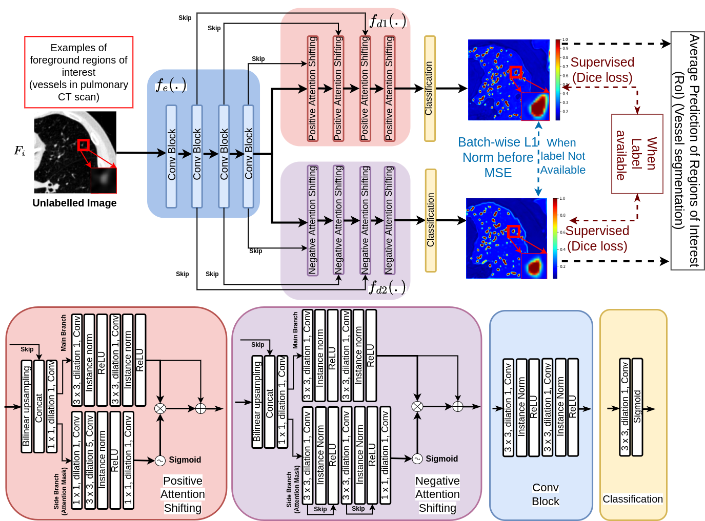
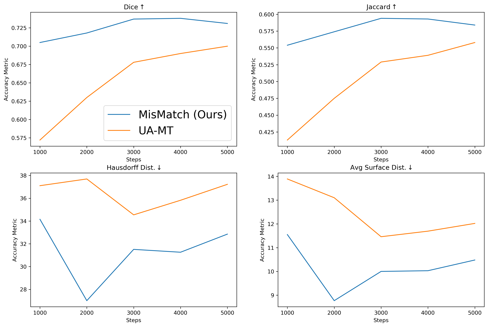

### News
_[2022 May 30th]_ Happy to announce that our paper got accepted at MIDL 2022 as an oral presentation (top 11.6%)!

_[2022 Sep 15th]_ We release a new 3D version of our implementation based on a new 3D dataset of left atrium and we release a new extended version of MisMatch on arxiv: https://arxiv.org/pdf/2110.12179.pdf

_[2023 Feb 13th]_  We are adding new experiments on 3D Brain Tumour segmentation and 3D lung tumour segmentation, will release the updates soon.

### Summary
This repository is an implementation of the MIDL 2022 Oral paper: '[Learning Morphological Feature Perturbations for Calibrated Semi-Supervised Segmentation](https://openreview.net/pdf?id=OL6tAasXCmi)'. This code base was written and maintained by [Moucheng Xu](https://moucheng2017.github.io/)

### Introduction
Consistency regularisation with input data perturbations in semi-supervised classification works 
because of the cluster assumption. However, the cluster assumption does not hold in the data space in 
segmentation (https://arxiv.org/abs/1906.01916). 
Fortunately, the cluster assumption can be observed in the feature space for segmentation. 
Therefore, we propose to use consistency regularisation on feature perturbations for semi-supervised segmentation and we propose to learn
feature perturbations end-to-end with network architecture manipulations based on differential morphological operations.

### Our Contributions and Method:
1) We provide a new interperation of ERF (effective receptive field: https://arxiv.org/abs/1701.04128) as a theoretical foundation for incorporating differential morphological operations of features in neural networks;
2) Based on our insight on the connection between ERF and morphological operations, we build a new encoder-decoder network architecture of semi-supervised segmentation with two decoders:
   1) positive attention decoder which enforces inductive bias to do differential dilation operations on the features;
   2) negative attention decoder which enforces another inductive bias to do differential erosion operations on the features.
3) We then apply l1 normalisation along batch dimension on the two outputs which come from the dilaiton decoder and the erosion decoder respectively before we apply a consistency loss.

See our paper (https://arxiv.org/pdf/2110.12179.pdf) for more details.

### Hyper-Parameters of experiments on the LA dataset
| LR   | Batch | Seed | Width | Consistency | Labels | Steps | 
|------|-------|------|-------|-------------|--------|-------|
| 0.01 | 4     | 1337 | 8     |       1     |      2 |  5000 |


### Results on the LA dataset between consistency on feature perturbations (Ours) and consistency on data perturbations (UA-MT)

| Models (5000 steps) | Dice (⬆) | Jaccard (⬆) | Hausdorff Dist. (⬇) | Average Surface Dist. (⬇) |
|:-------------------:|----------|-------------|---------------------|---------------------------|
|        UA-MT        | 0.73     | 0.58        | 32                  | 10                        | 
|   MisMatch (Ours)   | 0.70     | 0.55        | 37                  | 12                        | 




### Installation and Usage

This repository is based on PyTorch 1.4. To use this code, please first clone the repo and install the anaconda environments via:

   ```shell

   git clone https://github.com/moucheng2017/Morphological_Feature_Perturbation_SSL

   cd MisMatchSSL

   conda env create -f midl.yml

   ```

To train the baseline on LA with default hyperparameters:, use:

   ```shell
   cd MisMatchSSL/code # change directory to your working directory where you downloaded the github repo

   python train_LA_meanteacher_certainty_unlabel.py 
   ```


To train our proposed model MisMatch on LA with default hyperparameters, use:

   ```shell
   cd MisMatchSSL/code # change directory to your working directory where you downloaded the github repo

   python train_LA_mismatch.py 
   ```

To train the models on other custom datasets or the lung tumour or the brain tumour, you have to first prepare your datasets following:
```shell
--labelled/
    -- imgs/
        -- some_case_1.nii.gz
        -- some_case_2.nii.gz
        -- ...
    -- lbls/
        -- some_case_1.nii.gz
        -- some_case_2.nii.gz
        -- ...
--unlabelled/
    -- imgs/
        -- some_case_1.nii.gz
        -- some_case_2.nii.gz
        -- ...
--test/
    --imgs/
        -- some_case_1.nii.gz
        -- some_case_2.nii.gz
        -- ...
    --lbls/
        -- some_case_1.nii.gz
        -- some_case_2.nii.gz
        -- ...

```

To train our model on your own datasets, please use the following template, but do remember to change the data directory, if you set up "witdh" as 8 and cropping size at 96 x 96 x 96 (default in the training code, but in config), then a 12GB GPU should be enough:
```shell
cd MisMatchSSL/code # change directory to your working directory where you downloaded the github repo

python train_3D_mismatch.py \
--root_path '/directory/to/your/datasets/Task01_BrainTumour' \
--exp 'MisMatch_brain' \
--max_iterations 6000 \
--batch_size 4 \
--labeled_bs 2 \
--base_lr 0.001 \
--seed 1337 \
--width 8 \
--consistency 1.0
```

### Citation

If you find our paper or code useful for your research, please consider citing:

    @inproceedings{xu2022midl,

         title={Learning Morphological Feature Perturbations for Calibrated Semi-Supervised Segmentation},

         author={Xu, Moucheng and Zhou, Yukun and Jin, Chen and deGroot, Marius and Wilson Frederick J. and Blumberg, Stefano B. and Alexander, Daniel C. and Oxtoby, Neil P. and Jacob, Joseph},

         booktitle = {International Conference on Medical Imaging with Deep Learning (MIDL)},

         year = {2022} }


If you use the LA segmentation data, please also consider citing:

      @article{xiong2020global,

         title={A Global Benchmark of Algorithms for Segmenting Late Gadolinium-Enhanced Cardiac Magnetic Resonance Imaging},

         author={Xiong, Zhaohan and Xia, Qing and Hu, Zhiqiang and Huang, Ning and Vesal, Sulaiman and Ravikumar, Nishant and Maier, Andreas and Li, Caizi and Tong, Qianqian and Si, Weixin and others},

         journal={Medical Image Analysis},

         year={2020} }


### Note for the LA data we used:
The left atrium dataset We provided the processed h5 data in the `data` folder. You can refer the code in `code/dataloaders/la_heart_processing.py` to process your own data.

### Note for the other two 3D datasets we used:
The lung (Task_06) and brain tumour (Task_01) datasets are downloaded from the http://medicaldecathlon.com/

### Questions
Please contact 'xumoucheng28@gmail.com'


### Ackwnoledgement
Massive thanks to my amazing colleagues at UCL and GSK including Yukun Zhou, Jin Chen, Marius de Groot, Fred Wilson, Neil Oxtoby, Danny Alexander and Joe Jacob.
This code base is built upon a previous public code base on consistency on data space perturbations: https://github.com/yulequan/UA-MT
